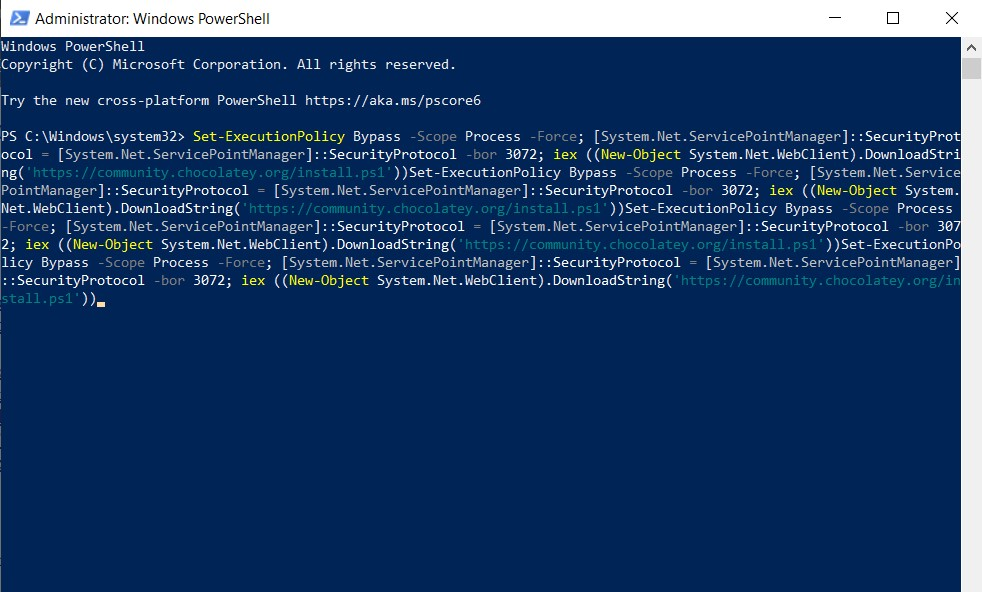

---
## Front matter
lang: ru-RU
title: Отчёт по лабораторной работе № 1
author: Нирдоши Всеволод Раджендер
institute: 
    - РУДН, Москва, Россия

date: 
    - 27 Cентября 2025

## Formatting
## i18n babel
babel-lang: russian
babel-otherlangs: english

## Formatting pdf
toc: false
toc-title: Содержание
slide_level: 2
aspectratio: 169
section-titles: true
theme: metropolis
header-includes:
 - \metroset{progressbar=frametitle,sectionpage=progressbar,numbering=fraction}

##{:class="img-responsive"}
##{:height="50%" width="50%"}
##{:height="700px" width="400px"}
##{height=25}{width=150}
---


# Презентация: Лабораторная работа №1

**Тема:** Установка дистрибутива LaTeX TeX Live в Windows 10

---

## Слайд 1. Цель работы

* Установить LaTeX-дистрибутив **TeX Live** в Windows 10
* Использовать **Chocolatey** и ручной способ установки
* Проверить успешность установки
* Подготовить систему для работы с LaTeX

---

## Слайд 2. Задание

1. Установить Chocolatey ([https://chocolatey.org/install](https://chocolatey.org/install))
2. С помощью Chocolatey установить TeX Live
3. Проверить установку
4. Рассмотреть альтернативную установку ([https://www.tug.org/texlive/windows.html](https://www.tug.org/texlive/windows.html))

---

## Слайд 3. Установка Chocolatey

* Перейти на сайт Chocolatey
* Скопировать команду установки
* Выполнить в **PowerShell (Admin)**
* Проверка: команда `choco` показывает версию

---

{height=175}
{height=175}

---

## Слайд 4. Установка TeX Live через Chocolatey

* Команда для установки:

```powershell
choco install texlive
```

* Подтвердить выполнение (`A` + Enter)
* Дождаться окончания (30–90 минут)
* Сообщение: *The install of texlive was successful*

---


---

## Слайд 5. Альтернативная установка вручную

* Сайт: [https://www.tug.org/texlive/windows.html](https://www.tug.org/texlive/windows.html)
* Скачать `install-tl-windows.exe`
* Easy Install → Next → Install
* Каталог по умолчанию: `C:\texlive\2025`

---

{height=175}
{height=175}

---

## Слайд 6. TeX Live Manager (TLShell)

* После установки появляется папка **TeX Live 2025** в меню Пуск
* Инструменты: cmd, документация, TLShell
* TLShell позволяет обновлять/удалять пакеты

---

{height=175}
{height=175}

---

## Слайд 7. Выводы

* Установлен Chocolatey и через него TeX Live 2025
* Установка прошла успешно
* Рассмотрен ручной способ установки
* Проверена работа TLShell
* Система готова для выполнения ЛР №2

---


## {.standout}

Спасибо за внимание!
