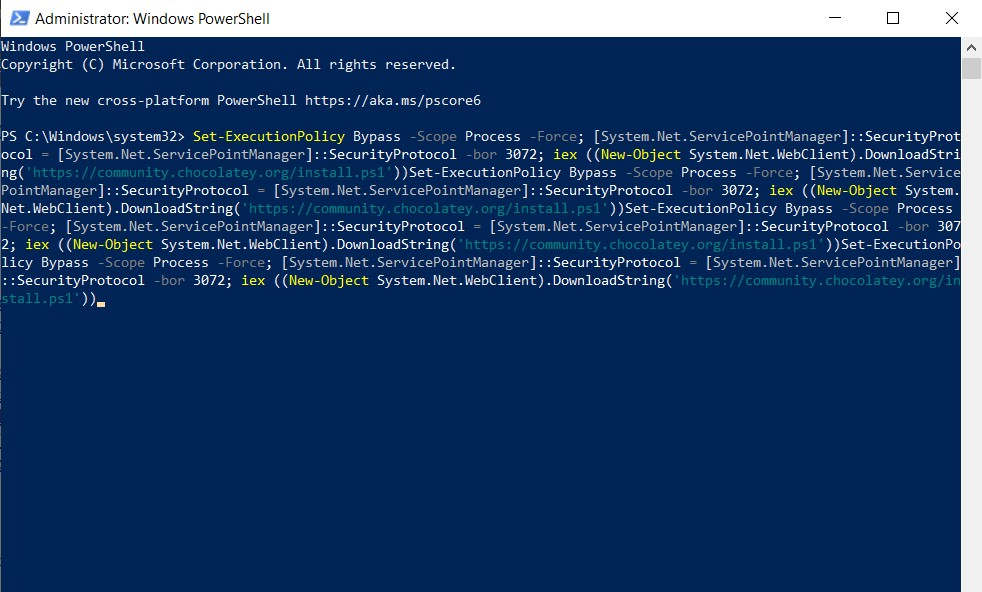
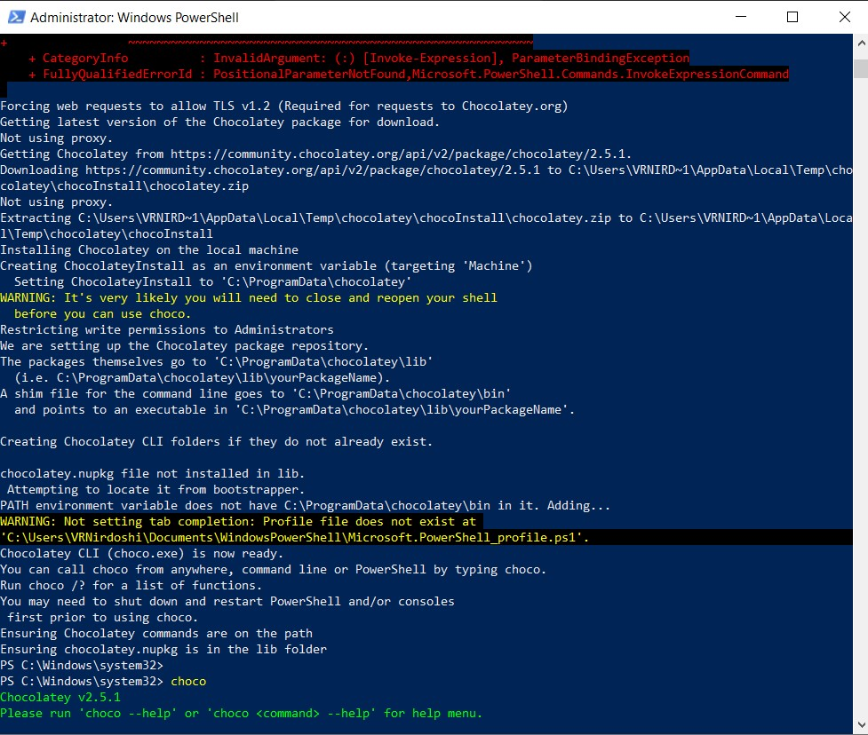
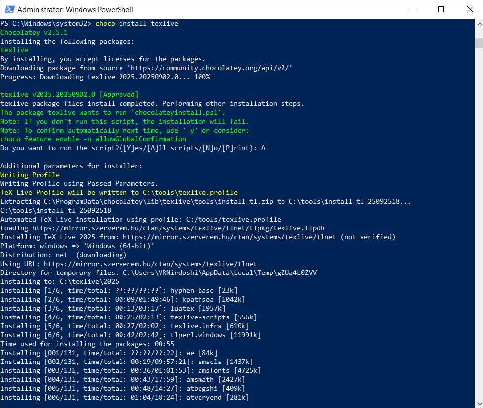
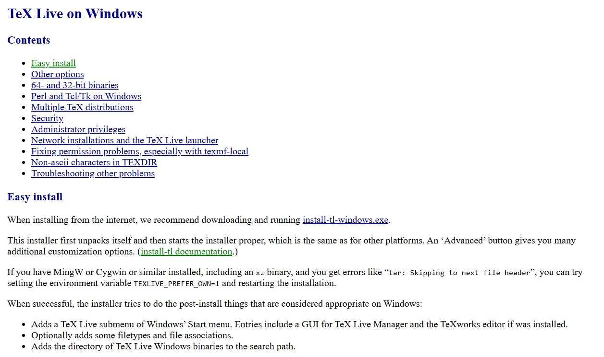
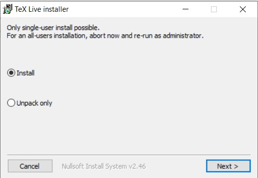
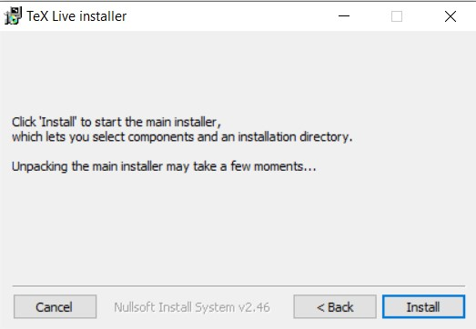
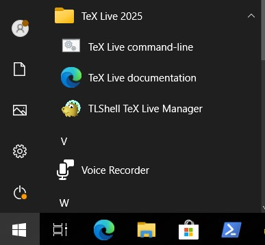
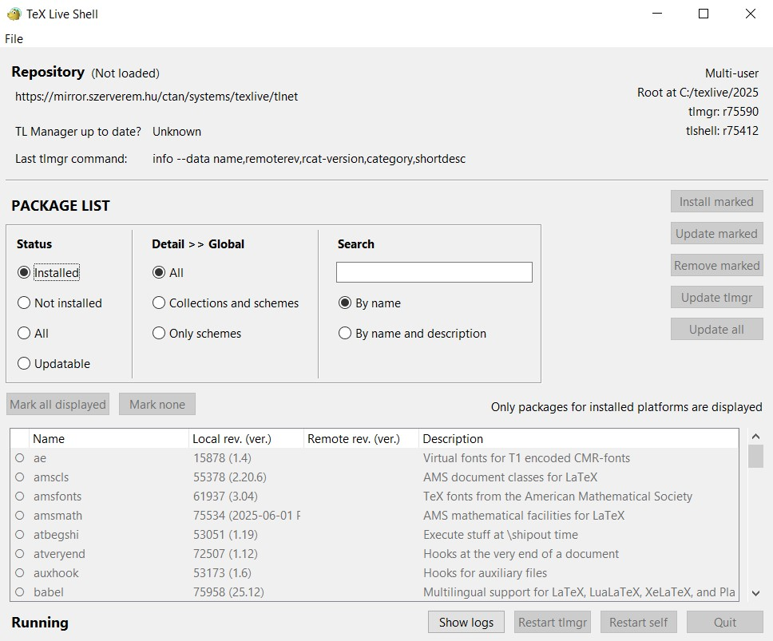

---
## Front matter
title: "Отчет по лабораторной работе №1"
subtitle: "Дисциплина: Computer Skills for Scientific Writing "
author: "Нирдоши Всеволод Раджендер"

## Generic otions
lang: ru-RU
toc-title: "Содержание"

## Bibliography
bibliography: cite.bib
csl: pandoc/csl/gost-r-7-0-5-2008-numeric.csl

## Pdf output format
toc: true # Table of contents
toc-depth: 2
lof: true # List of figures
lot: true # List of tables
fontsize: 12pt
linestretch: 1.5
papersize: a4
documentclass: scrreprt
## I18n polyglossia
polyglossia-lang:
  name: russian
  options:
	- spelling=modern
	- babelshorthands=true
polyglossia-otherlangs:
  name: english
## I18n babel
babel-lang: russian
babel-otherlangs: english
## Fonts
mainfont: IBM Plex Serif
romanfont: IBM Plex Serif
sansfont: IBM Plex Sans
monofont: IBM Plex Mono
mathfont: STIX Two Math
mainfontoptions: Ligatures=Common,Ligatures=TeX,Scale=0.94
romanfontoptions: Ligatures=Common,Ligatures=TeX,Scale=0.94
sansfontoptions: Ligatures=Common,Ligatures=TeX,Scale=MatchLowercase,Scale=0.94
monofontoptions: Scale=MatchLowercase,Scale=0.94,FakeStretch=0.9
mathfontoptions:
## Biblatex
biblatex: true
biblio-style: "gost-numeric"
biblatexoptions:
  - parentracker=true
  - backend=biber
  - hyperref=auto
  - language=auto
  - autolang=other*
  - citestyle=gost-numeric
## Pandoc-crossref LaTeX customization
figureTitle: "Рис."
tableTitle: "Таблица"
listingTitle: "Листинг"
lofTitle: "Список иллюстраций"
lotTitle: "Список таблиц"
lolTitle: "Листинги"
## Misc options
indent: true
header-includes:
  - \usepackage{indentfirst}
  - \usepackage{float} # keep figures where there are in the text
  - \floatplacement{figure}{H} # keep figures where there are in the text
---

## Цель работы

Установить дистрибутив LaTeX TeX Live в среде Windows 10 с помощью пакетного менеджера Chocolatey и вручную, проверить успешность установки и подготовить систему к созданию и компиляции документов в рамках последующих лабораторных работ.

## Задание

1. Установить Chocolatey в Windows 10 (официальный сайт: [https://chocolatey.org/install](https://chocolatey.org/install)).
2. С помощью Chocolatey установить дистрибутив TeX Live.
3. Проверить успешность установки.
4. Ознакомиться с альтернативным способом установки — через ручной запуск install-tl-windows.exe (официальный сайт: [https://www.tug.org/texlive/windows.html](https://www.tug.org/texlive/windows.html)).
5. Подготовить скриншоты основных этапов.

## Выполнение лабораторной

1. **Установка Chocolatey**

   * Перешёл на официальный сайт Chocolatey: [https://chocolatey.org/install](https://chocolatey.org/install).
   * Скопировал команду установки и выполнил её в PowerShell с правами администратора.
   
   * В процессе появились ошибки, но в итоге установка завершилась.
   
   * Проверка командой `choco` показала версию установленного менеджера пакетов.

2. **Установка TeX Live через Chocolatey**

    * Введите команду для установки TeX Live:

    ```powershell
    choco install texlive
    ```

    

    * Подтвердите выполнение (если появится запрос `Do you want to run the script?` введите `A` и нажмите Enter).
    * Дождитесь окончания процесса загрузки и установки (установка может занять 30–90 минут).
    * После завершения в PowerShell появится сообщение **“The install of texlive was successful”**.

    

3. **Альтернативная установка вручную**

   * Второй способ установки — через официальный сайт TeX Live: [https://www.tug.org/texlive/windows.html](https://www.tug.org/texlive/windows.html).
   * На странице загрузки предлагается установить файл install-tl-windows.exe.

   

   * После запуска установщика появляется окно выбора режима установки.

    

   * Далее нужно подтвердить установку.

   

4. **TeX Live Manager (TLShell)**

   * После установки в меню Пуск появилась папка **TeX Live 2025**.

    

   * В ней доступны инструменты: командная строка, документация и TLShell TeX Live Manager.
   * TLShell показывает список пакетов и позволяет их обновлять или удалять.

   

## Выводы

В ходе лабораторной работы был установлен менеджер Chocolatey и через него установлен дистрибутив TeX Live 2025. Установка завершилась успешно, что подтверждено выводом команд в PowerShell. Также рассмотрен альтернативный способ установки с помощью install-tl-windows.exe и проверена работа графического менеджера TLShell. Система готова к выполнению следующей лабораторной работы по созданию и компиляции LaTeX-документа.

