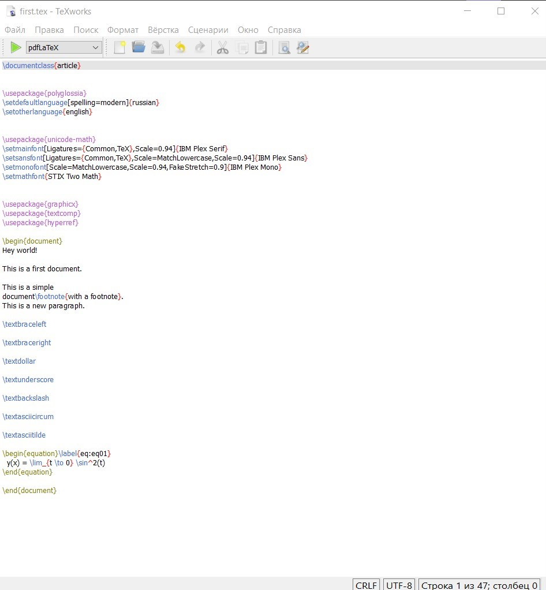
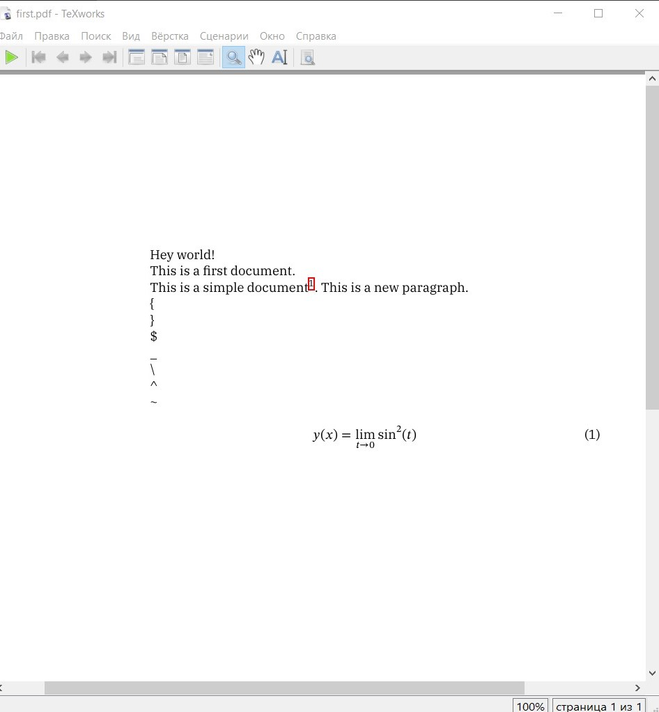
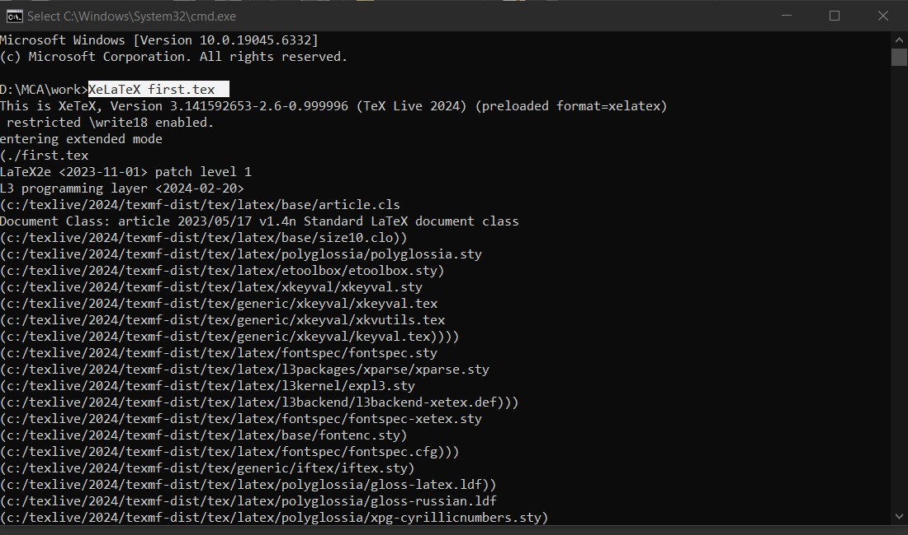
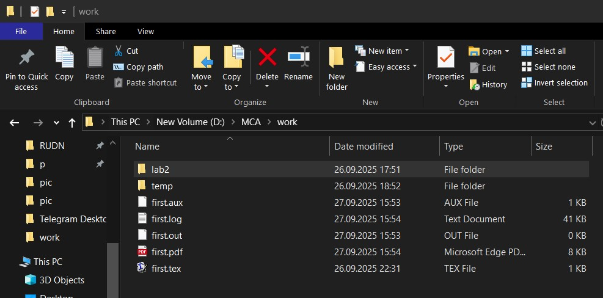

---
## Front matter
lang: ru-RU
title: Отчёт по лабораторной работе № 2
author: Нирдоши Всеволод Раджендер
institute: 
    - РУДН, Москва, Россия

date: 
    - 27 Cентября 2025

## Formatting
## i18n babel
babel-lang: russian
babel-otherlangs: english

## Formatting pdf
toc: false
toc-title: Содержание
slide_level: 2
aspectratio: 169
section-titles: true
theme: metropolis
header-includes:
 - \metroset{progressbar=frametitle,sectionpage=progressbar,numbering=fraction}

##{:class="img-responsive"}
##{:height="50%" width="50%"}
##{:height="700px" width="400px"}
##{height=25}{width=150}
---

# Презентация: Лабораторная работа №2

**Тема:** Создание первого документа в LaTeX

---

## Слайд 1. Цель работы

* Создать первый документ в LaTeX
* Изучить структуру `.tex`-файла
* Использовать основные команды и элементы
* Скомпилировать документ в PDF через **TeXworks** и **командную строку**

---

## Слайд 2. Задание

1. Установить и запустить **TeXworks**
2. Создать файл `first.tex`
3. Добавить в документ:

   * структуру документа
   * языковые пакеты
   * сноски
   * специальные символы
   * формулу
4. Скомпилировать PDF в редакторе
5. Скомпилировать PDF через командную строку

---

## Слайд 3. Создание файла

* В редакторе TeXworks создан файл `first.tex`
* Код документа включает преамбулу и тело

---

{height=225}

---

## Слайд 4. Код документа

Пример содержимого:

```latex
\documentclass{article}
\usepackage{polyglossia}
\setdefaultlanguage{russian}
\setotherlanguage{english}
...
\begin{document}
Hey world!
This is a first document.
...
\end{document}
```

---

{height=300}

---

## Слайд 5. Элементы кода

* **`\documentclass{article}`** — статья
* **polyglossia** — языки (русский, английский)
* **unicode-math** — современные шрифты и формулы
* **`\footnote{...}`** — сноска
* **`\textbraceleft`, `\textdollar` и др.** — вывод специальных символов
* **equation** — математическая формула:

  $$
  y(x) = \lim_{t \to 0} \sin^2(t)
  $$

---

## Слайд 6. Компиляция в TeXworks

* Выбран движок **XeLaTeX**
* Получен PDF с текстом, сноской, символами и формулой

---

{height=300}

---

## Слайд 7. Компиляция через командную строку

* В командной строке:

```cmd
cd C:\Users\<Имя>\Documents\latex-labs
XeLaTeX first.tex
```

* В результате появился `first.pdf`

---

{height=125}
{height=150}

---

## Слайд 8. Выводы

* Создан и скомпилирован первый LaTeX-документ
* Освоены базовые команды и структура `.tex`
* Проверена работа компиляции через редактор и командную строку
* Получен итоговый PDF-файл

---

## {.standout}

Спасибо за внимание!
