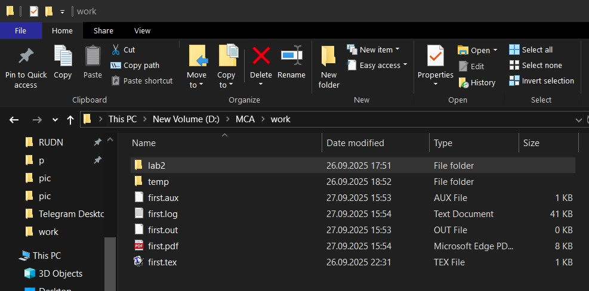

---
## Front matter
title: "Отчет по лабораторной работе №2"
subtitle: "Дисциплина: Computer Skills for Scientific Writing "
author: "Нирдоши Всеволод Раджендер"

## Generic otions
lang: ru-RU
toc-title: "Содержание"

## Bibliography
bibliography: cite.bib
csl: pandoc/csl/gost-r-7-0-5-2008-numeric.csl

## Pdf output format
toc: true # Table of contents
toc-depth: 2
lof: true # List of figures
lot: true # List of tables
fontsize: 12pt
linestretch: 1.5
papersize: a4
documentclass: scrreprt
## I18n polyglossia
polyglossia-lang:
  name: russian
  options:
	- spelling=modern
	- babelshorthands=true
polyglossia-otherlangs:
  name: english
## I18n babel
babel-lang: russian
babel-otherlangs: english
## Fonts
mainfont: IBM Plex Serif
romanfont: IBM Plex Serif
sansfont: IBM Plex Sans
monofont: IBM Plex Mono
mathfont: STIX Two Math
mainfontoptions: Ligatures=Common,Ligatures=TeX,Scale=0.94
romanfontoptions: Ligatures=Common,Ligatures=TeX,Scale=0.94
sansfontoptions: Ligatures=Common,Ligatures=TeX,Scale=MatchLowercase,Scale=0.94
monofontoptions: Scale=MatchLowercase,Scale=0.94,FakeStretch=0.9
mathfontoptions:
## Biblatex
biblatex: true
biblio-style: "gost-numeric"
biblatexoptions:
  - parentracker=true
  - backend=biber
  - hyperref=auto
  - language=auto
  - autolang=other*
  - citestyle=gost-numeric
## Pandoc-crossref LaTeX customization
figureTitle: "Рис."
tableTitle: "Таблица"
listingTitle: "Листинг"
lofTitle: "Список иллюстраций"
lotTitle: "Список таблиц"
lolTitle: "Листинги"
## Misc options
indent: true
header-includes:
  - \usepackage{indentfirst}
  - \usepackage{float} # keep figures where there are in the text
  - \floatplacement{figure}{H} # keep figures where there are in the text
---

## Цель работы

Создать первый документ в системе LaTeX, познакомиться с основными командами и элементами, научиться компилировать `.tex`-файл в PDF с помощью редактора **TeXworks** и через командную строку Windows.

---

## Задание

1. Установить и запустить редактор **TeXworks**.
2. Создать новый файл `first.tex`.
3. Написать код документа на языке LaTeX с использованием различных элементов:

   * базовая структура документа,
   * языковые пакеты,
   * сноски,
   * специальные символы,
   * математическая формула.
4. Скомпилировать документ в PDF в редакторе TeXworks.
5. Скомпилировать документ в PDF через командную строку с помощью команды:

   ```
   XeLaTeX first.tex
   ```

---

## Выполнение лабораторной

### 1. Создание файла и редактор

* Открыл редактор **TeXworks**, который входит в комплект TeX Live.
* Создал новый файл `first.tex`.


### 2. Написание кода документа

В файл был вставлен следующий код:

```latex
\documentclass{article}

\usepackage{polyglossia}
\setdefaultlanguage[spelling=modern]{russian}
\setotherlanguage{english}

\usepackage{unicode-math}
\setmainfont[Ligatures={Common,TeX},Scale=0.94]{IBM Plex Serif}
\setsansfont[Ligatures={Common,TeX},Scale=MatchLowercase,Scale=0.94]{IBM Plex Sans}
\setmonofont[Scale=MatchLowercase,Scale=0.94,FakeStretch=0.9]{IBM Plex Mono}
\setmathfont{STIX Two Math}

\usepackage{graphicx}
\usepackage{textcomp} 
\usepackage{hyperref}

\begin{document}
Hey world!

This is a first document.

This is a simple
document\footnote{with a footnote}.
This is a new paragraph.

\textbraceleft
\textbraceright
\textdollar
\textunderscore
\textbackslash
\textasciicircum
\textasciitilde

\begin{equation}\label{eq:eq01}
  y(x) = \lim_{t \to 0} \sin^2(t)
\end{equation}

\end{document}
```


### 3. Пояснение к коду

* **\documentclass{article}** — тип документа: статья.
* **Пакет polyglossia** — работа с языками (русский и английский).
* **Пакет unicode-math** — поддержка Unicode-шрифтов и современных математических символов.
* **\footnote{...}** — создание сноски.
* **Команды \textbraceleft, \textdollar и др.** — вывод специальных символов `{}`, `$`, `_`, `\`, `^`, `~`.
* **Окружение equation** — вставка математической формулы с автоматической нумерацией:

  $$
  y(x) = \lim_{t \to 0} \sin^2(t)
  $$

### 4. Компиляция в редакторе TeXworks

* В меню TeXworks выбран движок **XeLaTeX**.
* После нажатия на «Компиляция» был получен файл **first.pdf**, содержащий текст, сноску, специальные символы и формулу.

### 5. Компиляция через командную строку

* В командной строке Windows выполнен переход в папку с файлом:

  ```
  cd C:\Users\<Имя>\Documents\latex-labs
  ```
* Выполнена команда:

  ```
  XeLaTeX first.tex
  ```


* В результате появился файл **first.pdf**, совпадающий по содержанию с версией, собранной в TeXworks.



---

## Выводы

В ходе лабораторной работы был создан и скомпилирован первый документ на языке LaTeX.

* Изучена структура `.tex`-файла: преамбула, тело документа.
* Добавлены и протестированы элементы: сноски, специальные символы, математическая формула.
* Выполнена компиляция документа в двух режимах: через графический редактор **TeXworks** и через **командную строку**.
* Получен PDF-документ, что подтверждает корректность работы установленного дистрибутива TeX Live.

