---
## Front matter
lang: ru-RU
title: Отчёт по лабораторной работе № 3
author: Нирдоши Всеволод Раджендер
institute: 
    - РУДН, Москва, Россия

date: \today
lang: ru-RU

## Formatting
## i18n babel
babel-lang: russian
babel-otherlangs: english

## Formatting pdf
toc: false
toc-title: Содержание
slide_level: 2
aspectratio: 169
section-titles: true
theme: metropolis
header-includes:
 - \metroset{progressbar=frametitle,sectionpage=progressbar,numbering=fraction}

##{:class="img-responsive"}
##{:height="50%" width="50%"}
##{:height="700px" width="400px"}
##{height=25}{width=150}
---

# **Презентация по лабораторной работе №3**

## **Тема:**

**Математический набор в LaTeX**

## **Задача**

Изучить особенности математического набора в системе **LaTeX**:

* Освоить **математический режим (math mode)**
* Научиться использовать пакеты:
  **amsmath**, **amssymb**, **bm**, **mathtools**
* Применить различные **шрифты и греческие символы**
* Освоить оформление **научных и технических формул**

## **Цель работы**

* Освоить создание и форматирование **математических формул, уравнений и символов**
* Различать режимы: **inline** и **display**
* Научиться использовать **шрифты, греческие буквы, матрицы и выравнивание**

## **Ход работы**

Работа выполнена по разделам (3.1–3.7) главы *Mathematics Typing*.
Каждый подраздел демонстрирует отдельные возможности LaTeX.

## **3.1 Математический режим (Math Mode)**

Использование встроенного и выведенного режима:

* Inline: `$y = mx + c$`
* Display:
  $$
  y = mx + c
  $$

Используются верхние и нижние индексы, функции `\sin`, символы `\theta`.

**Вывод:**
Inline размещается в тексте, Display — в центре строки.

## Скриншот

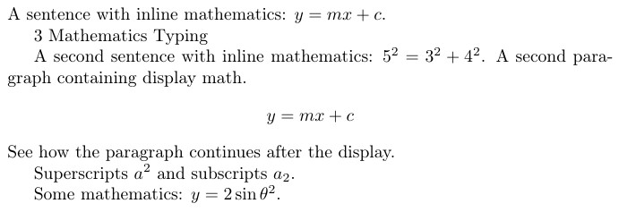

## **3.1.2 Отображаемая математика**

* Пример интеграла:
  
  ```latex
  \int_{-\infty}^{+\infty} e^{-x^2} \diff x`
  ```
  
* Использована команда:

  ```latex
  \newcommand{\diff}{\mathop{}\!d}
  ```

* `equation` автоматически нумерует формулы.

**Вывод:**
Оформление длинных уравнений с номерами и дифференциалом.

## Скриншот

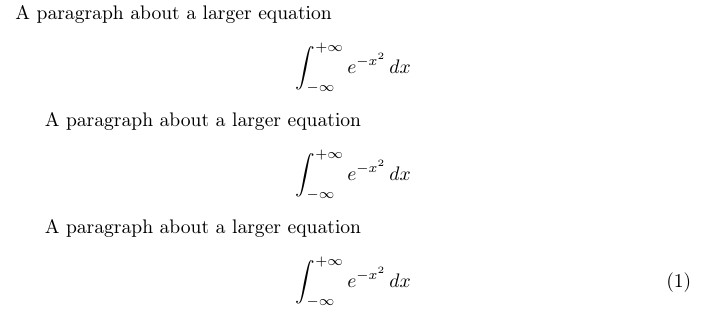

## **3.2 Пакет amsmath**

Использовано окружение `align*`:

```latex
Q_{n,k} = Q_{n-1,k}+Q_{n-1,k-1}+\binom{n}{k}
```

Позволяет:

* Выравнивание по символу `&`
* Добавление текста `\text{for $n,k>0$}`
* Создание биномиальных коэффициентов

**Вывод:**
Упорядоченные, выровненные формулы.

## Скриншот

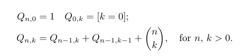

## **3.2.1 Матрицы AMS**

```latex
\begin{matrix}...\end{matrix}
\begin{pmatrix}...\end{pmatrix}
\begin{bmatrix}...\end{bmatrix}
```

**Типы:**

* Без скобок
* В круглых
* В квадратных

**Вывод:**
Оформление матриц различного вида.

## Скриншот

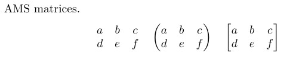

## **3.3 Шрифты в математическом режиме**

**Команды изменения шрифта:**

- `\mathrm{}` — прямое начертание  
- `\mathit{}` — курсив  
- `\mathbf{}` — жирный  
- `\mathsf{}` — без засечек  
- `\mathtt{}` — моноширинный  
- `\mathbb{}` — двойной штрих


**Вывод:**
Комбинирование шрифтов помогает выделять элементы в формулах.

## Скриншот

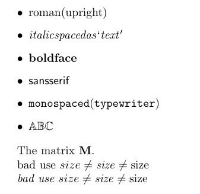

## **3.4 Дополнительные выравнивания**

* `gather` — выравнивает строки по центру
* `multline` — разбивает длинное уравнение на несколько строк

**Вывод:**
Красивое оформление больших выражений.

## Скриншот

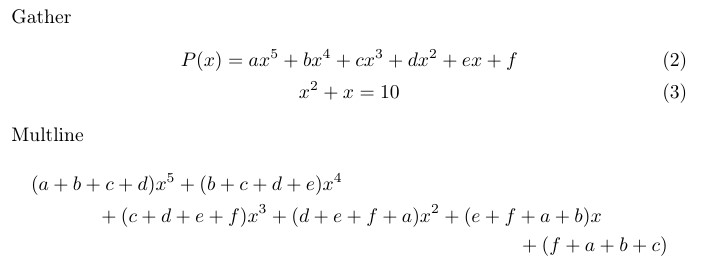

## **3.4.1 Столбцы и выравнивание**

Использование `align*` и `aligned`:

```latex
a &= b+1 & c &= d+2
```

**Вывод:**
Выравнивание уравнений по знакам равенства и создание многоколонных структур.

## Скриншот

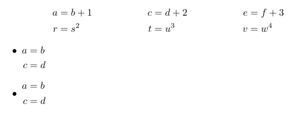

## **3.5 Жирный математический шрифт**

Примеры:

```latex
\boldmath
\mathbf{y}
\bm{y}
```

`\bm` позволяет выделять жирным греческие символы.

**Вывод:**
Возможность выделения нужных элементов в формулах.

## Скриншот

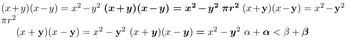

## **3.6 Пакет mathtools**

```latex
\begin{pmatrix*}[r] ... \end{pmatrix*}
```

Расширяет **amsmath**, добавляет выравнивание столбцов в матрицах.

**Вывод:**
Более гибкое форматирование математических объектов.-

## Скриншот

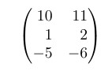

## **3.7 Unicode Math**

Использование **LuaLaTeX** и пакета **unicode-math**:

```latex
\setmainfont{TeX Gyre Pagella}
\setmathfont{TeX Gyre Pagella Math}
```

Показывает работу с современными OpenType-шрифтами и Unicode-символами:

```latex
A + \symfrak{A} + \symbf{A} + \symcal{A} + \symscr{A} + \symbb{A}
```

**Вывод:**
Современный способ набора математических символов с расширенной типографикой.

## Скриншот

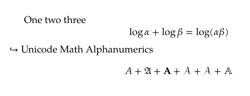

## **Греческие буквы**

$$
\pi, \theta, \beta, \xi, \Lambda, \Delta, \Psi, \Omega
$$

**Вывод:**
Используются в большинстве формул и задаются простыми командами.

## Скриншот

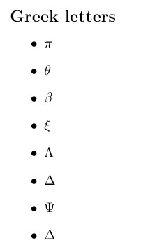

## **Выводы**

1. Освоены режимы **inline** и **display**
2. Изучены пакеты **amsmath**, **bm**, **mathtools**, **unicode-math**
3. Разобраны **матрицы** и **выравнивания**
4. Опробованы **шрифты и жирное начертание**
5. Освоена работа с **греческими буквами и Unicode-математикой**

## **Выполненные упражнения**

1. Базовая работа с математическим режимом (inline и display).
2. Добавление греческих букв (строчные и прописные).
3. Эксперименты с командами изменения шрифта и их вложением.

## **Итоговый вывод**

Лабораторная работа выполнена успешно.
Изучены основные возможности LaTeX для математического набора, включая Unicode-математику.
Результаты пригодны для оформления научных текстов и технических отчётов.

## **Список литературы**

1. Львовский С.М. Набор и вёрстка в системе LaTeX. Москва: МЦНМО, 2014. С. 400.

## {.standout}

Спасибо за внимание!
