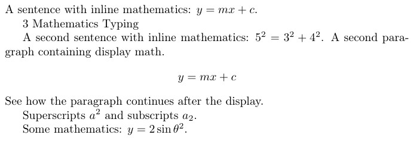
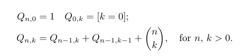
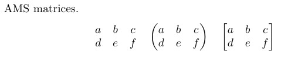
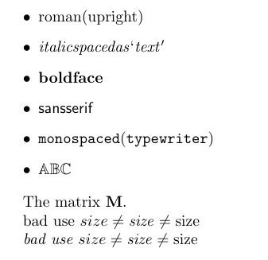
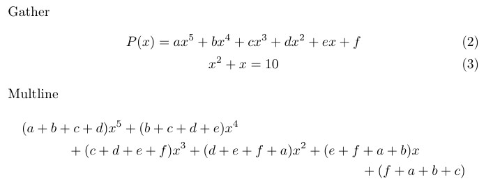
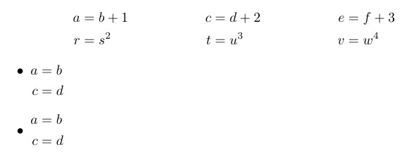
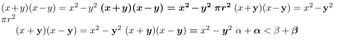
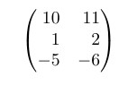
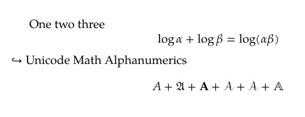
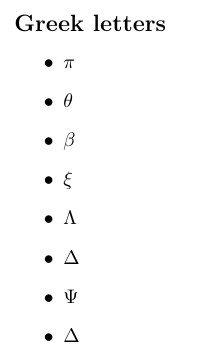

---
## Front matter
title: "Отчет по лабораторной работе №3"
subtitle: "Дисциплина: Computer Skills for Scientific Writing "
author: "Нирдоши Всеволод Раджендер"

## Generic otions
lang: ru-RU
toc-title: "Содержание"

## Bibliography
bibliography: cite.bib
csl: pandoc/csl/gost-r-7-0-5-2008-numeric.csl
link-citations: true

## Pdf output format
toc: true # Table of contents
toc-depth: 2
lof: true # List of figures
lot: true # List of tables
fontsize: 12pt
linestretch: 1.5
papersize: a4
documentclass: scrreprt

## I18n babel
babel-lang: russian
babel-otherlangs: english
## Fonts
## Критически важные настройки для русского языка
mainfont: IBM Plex Serif
## I18n polyglossia
## Настройки для русского языка
polyglossia-lang:
  name: russian
  options:
    - spelling=modern
    - babelshorthands=true
polyglossia-otherlangs:
  name: english

romanfont: IBM Plex Serif
sansfont: IBM Plex Sans
monofont: IBM Plex Mono
mathfont: STIX Two Math
romanfontoptions: Ligatures=Common,Ligatures=TeX,Scale=0.94
sansfontoptions: Ligatures=Common,Ligatures=TeX,Scale=MatchLowercase,Scale=0.94
monofontoptions: Scale=MatchLowercase,Scale=0.94,FakeStretch=0.9
mathfontoptions:
## Pandoc-crossref LaTeX customization
figureTitle: "Рис."
tableTitle: "Таблица"
listingTitle: "Листинг"
lofTitle: "Список иллюстраций"
lotTitle: "Список таблиц"
lolTitle: "Листинги"
## Misc options
indent: true
header-includes:
  - \usepackage{indentfirst}
  - \usepackage{float} # keep figures where there are in the text
  - \floatplacement{figure}{H} # keep figures where there are in the text
---


### **Задач**

Изучить особенности математического набора в системе **LaTeX** , научиться использовать **математический режим (math mode)**, работать с пакетами **amsmath**, **amssymb**, **bm** и **mathtools**, а также освоить применение различных шрифтов и греческих символов при оформлении научных и технических текстов.

---

### **Цель**

Освоить основные возможности LaTeX для создания и форматирования математических формул, уравнений, символов, матриц и других элементов.
Научиться различать встроенный (inline) и выведенный (display) математические режимы, применять команды изменения шрифтов, использовать греческие буквы и выравнивание формул.

---

### **Ход работы**

Исходный код лабораторной работы включает несколько подразделов (3.1–3.7), демонстрирующих различные функции математического набора в LaTeX. Ниже приводится описание каждого из них.

---

#### **3.1 Математический режим (Math Mode)**

**Код:**

```latex
A sentence with inline mathematics: \( y = mx + c \).

A second sentence with inline mathematics:
$5^{2}=3^{2}+4^{2}$.
A second paragraph containing display math.
\[
y = mx + c
\]
See how the paragraph continues after the display.

Superscripts $a^{2}$ and subscripts $a_{2}$.

Some mathematics: $y = 2 \sin \theta^{2}$.
```



**Пояснение:**
В данном разделе показано использование **математического режима**:

* **Встроенный (inline)** режим — используется для коротких формул в тексте и обозначается `$...$` или `\(...\)`.
  Пример: $y = mx + c$, $5^{2}=3^{2}+4^{2}$.
* **Выведенный (display)** режим — обозначается `\[...\]` и размещает формулу по центру на отдельной строке:
  $$
  y = mx + c
  $$
* Используются **верхние индексы** (`^`) и **нижние индексы** (`_`), а также стандартные функции, например `\sin`.
* Добавлен пример с греческой буквой `\theta`.

**Назначение:**
Показать различие между встроенным и отдельным математическим режимом и их влияние на форматирование текста.

---

#### **3.1.2 Отображаемая математика (Display Mathematics)**

**Код:**

```latex
\[
\int_{-\infty}^{+\infty} e^{-x^2} \, dx
\]

\[
\int_{-\infty}^{+\infty} e^{-x^2} \diff x
\]

\begin{equation}
\int_{-\infty}^{+\infty} e^{-x^2} \, dx
\end{equation}
```


**Пояснение:**
Демонстрируется использование **интегралов** и **нумерованных уравнений**:

* Символ интеграла `\int` имеет пределы интегрирования, задаваемые через `_` и `^`.
* Команда `\diff` определена как:

  ```latex
  \newcommand{\diff}{\mathop{}\!d}
  ```

  и используется для корректного отображения дифференциала ( d ).
* Окружение `equation` автоматически добавляет **нумерацию** формулы.

**Назначение:**
Изучить синтаксис длинных уравнений и способы добавления нумерации и интервалов в математическом режиме.

---

#### **3.2 Пакет amsmath**

**Код:**

```latex
\begin{align*}
Q_{n,0} &= 1 \quad Q_{0,k} = [k=0]; \\
Q_{n,k} &= Q_{n-1,k}+Q_{n-1,k-1}+\binom{n}{k},
\quad\text{for $n$, $k>0$.}
\end{align*}
```



**Пояснение:**
Пакет **amsmath** предоставляет расширенные возможности для работы с формулами:

* Окружение `align*` выравнивает уравнения по символу `&`.
* Команда `\quad` добавляет горизонтальный пробел.
* `\text{}` вставляет обычный текст внутрь формулы.
* `\binom{n}{k}` создаёт **биномиальные коэффициенты**.

**Назначение:**
Показать применение выравнивания формул и оформление нескольких строк уравнений.

---

#### **3.2.1 Матрицы AMS (AMS Matrices)**

**Код:**

```latex
\[
\begin{matrix}
a & b & c \\
d & e & f
\end{matrix}
\quad
\begin{pmatrix}
a & b & c \\
d & e & f
\end{pmatrix}
\quad
\begin{bmatrix}
a & b & c \\
d & e & f
\end{bmatrix}
\]
```



**Пояснение:**
Здесь показано создание различных видов **матриц**:

* `matrix` — без скобок,
* `pmatrix` — в круглых скобках,
* `bmatrix` — в квадратных скобках.

**Назначение:**
Научиться оформлять матрицы с различными типами ограничивающих скобок.

---

#### **3.3 Шрифты в математическом режиме (Fonts in Math Mode)**

**Код:**

```latex
\begin{itemize}
\item $\mathrm{roman(upright)}$
\item $\mathit{italic spaced as ‘text’}$
\item $\mathbf{boldface}$
\item $\mathsf{sansserif}$
\item $\mathtt{monospaced(typewriter)}$
\item $\mathbb{ABC}$
\end{itemize}

The matrix $\mathbf{M}$.

$\text{bad use } size \neq \mathit{size} \neq \mathrm{size} $

\textit{$\text{bad use } size \neq \mathit{size} \neq \mathrm{size} $}
```



**Пояснение:**
Продемонстрированы различные команды изменения шрифта:

| Команда     | Назначение                      |
| ----------- | ------------------------------- |
| `\mathrm{}` | Прямое начертание               |
| `\mathit{}` | Курсив                          |
| `\mathbf{}` | Жирный шрифт                    |
| `\mathsf{}` | Без засечек                     |
| `\mathtt{}` | Моноширинный                    |
| `\mathbb{}` | Двойной штрих (blackboard bold) |

Команда `\text{}` позволяет вставлять обычный текст в математическом режиме с правильными интервалами.

**Назначение:**
Понять назначение и визуальные различия математических шрифтов.

---

#### **3.4 Дополнительные выравнивания amsmath (Further amsmath Alignments)**

**Код:**

```latex
\begin{gather}
P(x)=ax^{5}+bx^{4}+cx^{3}+dx^{2}+ex +f\\
x^2+x=10
\end{gather}

\begin{multline*}
(a+b+c+d)x^{5}+(b+c+d+e)x^{4} \\
+(c+d+e+f)x^{3}+(d+e+f+a)x^{2}+(e+f+a+b)x\\
+ (f+a+b+c)
\end{multline*}
```



**Пояснение:**

* `gather` — выравнивает несколько строк по центру.
* `multline` — используется для длинных формул, переносимых на несколько строк.
  Первая строка выравнивается влево, последняя — вправо.

**Назначение:**
Научиться красиво оформлять многострочные и громоздкие уравнения.

---

#### **3.4.1 Столбцы в математических выравниваниях (Columns in Math Alignments)**

**Код:**

```latex
\begin{align*}
a &= b+1 & c &= d+2 & e &= f+3 \\
r &= s^{2} & t &=u^{3} & v &= w^{4}
\end{align*}

\begin{itemize}
\item
$\begin{aligned}[t]
a&=b\\
c&=d
\end{aligned}$
\item
$\begin{aligned}
a&=b\\
c&=d
\end{aligned}$
\end{itemize}
```



**Пояснение:**

* `align*` создаёт таблицу уравнений, выравнивая их по знакам равенства.
* `aligned` используется внутри других формул для небольших систем уравнений.
* `[t]` задаёт выравнивание по верхней строке блока.

**Назначение:**
Освоить создание многоколонных структур уравнений и вложенных блоков.

---

#### **3.5 Жирный математический шрифт (Bold Math)**

**Код:**

```latex
(x+y)(x-y)=x^{2}-y^{2}
{\boldmath $(x+y)(x-y)=x^{2}-y^{2}$ $\pi r^2$}
(x+\mathbf{y})(x-\mathbf{y})=x^{2}-{\mathbf{y}}^{2}
\mathbf{\pi} r^2
(x+\bm{y})(x-\bm{y}) \bm{=} x^{2}-{\bm{y}}^{2}
\alpha + \bm{\alpha} < \beta + \bm{\beta}
```



**Пояснение:**

* `\boldmath` делает всю формулу жирной.
* `\mathbf{}` делает жирными только латинские буквы.
* `\bm{}` (из пакета **bm**) позволяет выделять жирным любые символы, включая греческие.

**Назначение:**
Продемонстрировать способы выделения важных элементов в формулах.

---

#### **3.6 Пакет mathtools**

**Код:**

```latex
\[
\begin{pmatrix*}[r]
10&11\\
1&2\\-5&-6
\end{pmatrix*}
\]
```



**Пояснение:**
Пакет **mathtools** расширяет возможности **amsmath**.
Окружение `pmatrix*` с параметром `[r]` выравнивает элементы по правому краю.

**Назначение:**
Позволяет более точно управлять форматированием матриц и формул.

---

#### **3.7 Unicode Math**

**Код:**

```latex
% !TEX lualatex
\documentclass[a4paper]{article}
\usepackage{unicode-math}
\setmainfont{TeX Gyre Pagella}
\setmathfont{TeX Gyre Pagella Math}
\begin{document}
One two three
\[
\log \alpha + \log \beta = \log(\alpha\beta)
\]
Unicode Math Alphanumerics
\[
A + \symfrak{A} + \symbf{A} + \symcal{A} + \symscr{A} + \symbb{A}
\]
\end{document}
```



**Пояснение:**
В этом разделе продемонстрировано использование **пакета `unicode-math`** с движком **LuaLaTeX** для работы с **OpenType-шрифтами**:

* Подключается пакет `unicode-math`, который позволяет использовать современные математические шрифты.
* Команды `\setmainfont` и `\setmathfont` задают основной и математический шрифты документа.
* Используются греческие буквы (`\alpha`, `\beta`) и различные математические начертания:
  `\symfrak{A}` (готический), `\symbf{A}` (жирный), `\symcal{A}` (каллиграфический), `\symscr{A}` (рукописный), `\symbb{A}` (двойной штрих).

**Назначение:**
Познакомиться с современным способом отображения математических шрифтов в LaTeX и возможностями использования Unicode-символов.

---

#### **Греческие буквы (Greek Letters)**

**Код:**

```latex
\begin{itemize}
\item $\pi$
\item $\theta$
\item $\beta$
\item $\xi$
\item $\Lambda$
\item $\Delta$
\item $\Psi$
\item $\Delta$
\end{itemize}
```



**Пояснение:**
Используются греческие символы — как строчные, так и прописные.
Команды пишутся в виде `\alpha`, `\beta`, `\Gamma`, `\Omega` и т. д.

---

### **Выводы**

1. Освоены основы математического режима LaTeX — inline и display.
2. Изучены возможности пакетов **amsmath**, **bm**, **mathtools** и **unicode-math** для форматирования формул.
3. Разобраны способы выравнивания и создания матриц.
4. Опробованы различные стили шрифта и жирное выделение символов.
5. Изучено применение греческих букв и Unicode-математики.
6. Получен опыт создания профессионально оформленных математических документов.

---

### **Выполненные упражнения**

Из раздела **3.8 Exercises** выполнены следующие задания:

1. **Попробуйте базовую работу с математическим режимом:** возьмите примеры и переключайтесь между встроенным *(inline)* и выведенным *(display)* математическими режимами.  
   Наблюдается различие в расположении формул — встроенные располагаются в тексте, а выведенные центрируются на отдельной строке.

2. **Попробуйте добавить другие греческие буквы**, как строчные, так и прописные.  
   Названия символов можно угадать по их написанию — например, `\alpha`, `\beta`, `\Gamma`, `\Omega` и т. д.

3. **Поэкспериментируйте с командами изменения шрифта:** что произойдет, если попытаться вложить их друг в друга?  
   Результат показывает, что вложение разных команд (`\mathbf`, `\mathit`, `\mathrm` и т. д.) может менять начертание только допустимых символов, а часть стилей не совмещается между собой.

---

### **Итоговый вывод**

Лабораторная работа выполнена успешно.
Были изучены основные принципы математического набора в LaTeX, включая использование различных пакетов, режимов, шрифтов и символов, а также применение Unicode-математики. Полученные знания могут применяться при подготовке научных публикаций, отчётов и учебных материалов, требующих точного и аккуратного математического оформления.

### Список литературы {.unnumbered}

@book

