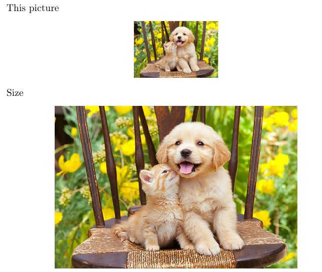
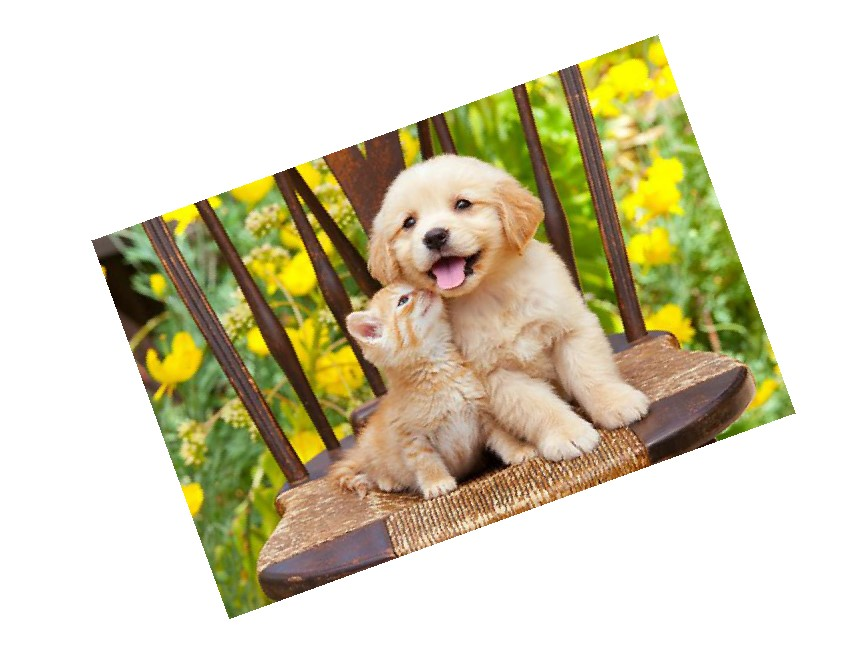
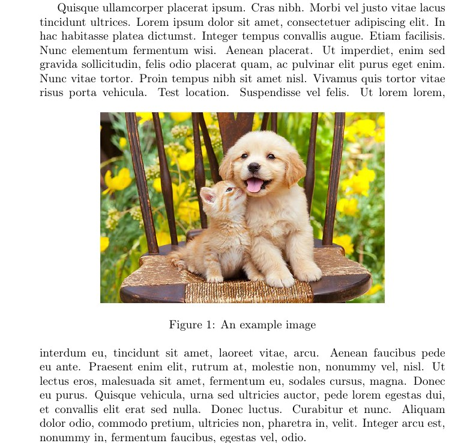
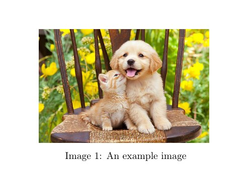
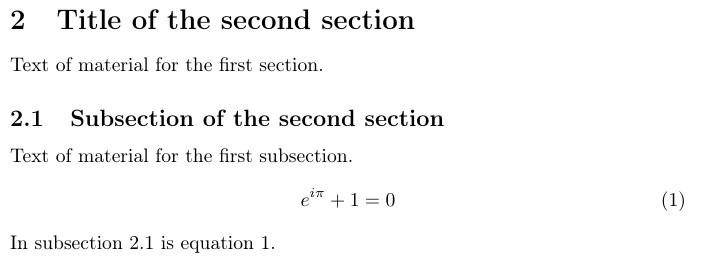
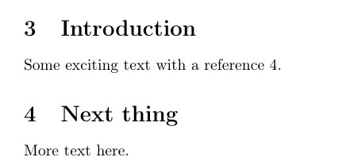

---
## Front matter
lang: ru-RU
title: Отчёт по лабораторной работе № 4
author: Нирдоши Всеволод Раджендер
institute: 
    - РУДН, Москва, Россия

date: \today
lang: ru-RU

## Formatting
## i18n babel
babel-lang: russian
babel-otherlangs: english

## Formatting pdf
toc: false
toc-title: Содержание
slide_level: 2
aspectratio: 169
section-titles: true
theme: metropolis
header-includes:
 - \metroset{progressbar=frametitle,sectionpage=progressbar,numbering=fraction}

##{:class="img-responsive"}
##{:height="50%" width="50%"}
##{:height="700px" width="400px"}
##{height=25}{width=150}
---

# **Презентация по лабораторной работе №4**

## **Тема:**

**Работа с графикой и плавающими объектами в LaTeX**

## **Цель работы**

Изучить возможности вставки, изменения и размещения графических изображений в LaTeX,
а также освоить работу с плавающими объектами, подписями и перекрёстными ссылками.

## **Задачи**

1. Освоить вставку собственных изображений в документ LaTeX.
2. Изучить параметры `height`, `width`, `scale`, `angle`, `trim`.
3. Понять различие между `\textwidth` и `\linewidth`.
4. Научиться использовать плавающие окружения `figure` и спецификаторы `[h]`, `[t]`, `[b]`, `[H]`, `[p]`.
5. Освоить перекрёстные ссылки с помощью `\label` и `\ref`.
6. Проверить влияние порядка команд `\label` и `\caption`.
7. Разобраться с размещением метки внутри и вне окружения `equation`.

## **Вставка изображений**

* В документ добавлен файл `pic.jpg`.
* Использовались различные параметры масштаба и высоты:

  ```latex
  \includegraphics[width=0.7\textwidth]{pic.jpg}
  ```

* Изображение корректно отображалось.

## Скриншот

{height=250}

## **Изменение внешнего вида графики**

* Тестировались ключи `scale`, `angle`, `trim`, `clip`:

  ```latex
  \includegraphics[scale=0.6, angle=20]{pic}
  \includegraphics[clip, trim=50 25 50 30]{pic}
  ```

* Менялись масштаб, поворот и обрезка изображения.

## Скриншот



## **Использование плавающих объектов**

* Окружение `figure` с параметром `[ht]`:

  ```latex
  \begin{figure}[ht]
  \includegraphics[width=0.7\textwidth]{pic.jpg}
  \caption{An example image}
  \end{figure}
  ```

* LaTeX сам подбирает оптимальное место.

## Скриншот


## **Точное позиционирование**

* Использован параметр `[H]` из пакета `float`:

  ```latex
  \begin{figure}[H]
  ...
  \end{figure}
  ```

* Изображение вставляется строго в месте вызова.

## Скриншот

{height=290}

## **Другие типы плавающих объектов**

* Применён пакет `trivfloat`:

  ```latex
  \begin{image}
  \includegraphics[width=0.5\textwidth]{pic}
  \caption{An example image}
  \end{image}
  ```

* Создано новое окружение `image`.

## Скриншот



## **Перекрёстные ссылки**

* Использованы команды `\label` и `\ref`:

  ```latex
  \subsection{Subsection of the first section}
  \label{subsec:labelone}
  \begin{equation}
  e^{i\pi}+1=0
  \label{eq:labeltwo}
  \end{equation}
  ```

* После двойной компиляции ссылки отображаются правильно.

## Скриншот



## **Дополнительные разделы**

* Добавлены секции:

  ```latex
  \section{Introduction}
  \section{Next thing}
  \label{sec:next}
  ```

* Ссылки между ними корректно работают.

## Скриншот



## **Проверка `\label` и `\caption`**

* Проверено расположение `\label` до и после `\caption`.
* Видимой разницы не было (так как одно изображение).
* Правильный порядок:

  ```latex
  \caption{Example}
  \label{fig:example}
  ```

## **Проверка `\label` вне `equation`**

* Код:

  ```latex
  \begin{equation}
      e^{i\pi}+1 = 0
  \end{equation}
  \label{eq:labeltwo}
  ```

* Выдал ошибку при компиляции.
* Вывод: `\label` для уравнения должен быть **внутри** `equation`.

## Скриншот


## **Выполнение упражнений**

* Использовано своё изображение.
* Изменены параметры `height`, `width`, `scale`, `angle`, `trim`.
* Разницы между `\textwidth` и `\linewidth` нет (одноколоночный режим).
* Проверены все виды размещения `[h]`, `[t]`, `[b]`, `[H]`, `[p]`.
* Созданы секции и перекрёстные ссылки.
* Проверено влияние порядка `\label` и `\caption`.
* Проверено поведение метки вне `equation`.

## **Результаты**

* Изучены основные способы вставки и редактирования изображений.
* Освоены параметры масштабирования и поворота.
* Изучено поведение плавающих объектов.
* Проверены перекрёстные ссылки.
* Подтверждено правило размещения `\label` внутри `equation`.

## **Вывод**

В результате лабораторной работы:

* Освоены команды работы с графикой в LaTeX.
* Научился вставлять, изменять и позиционировать изображения.
* На практике изучено поведение плавающих объектов и меток.
  **Все задачи выполнены, цель достигнута.**

## **Список литературы**

1. Львовский С.М. Набор и вёрстка в системе LaTeX. Москва: МЦНМО, 2014. С. 400.

## {.standout}

Спасибо за внимание!