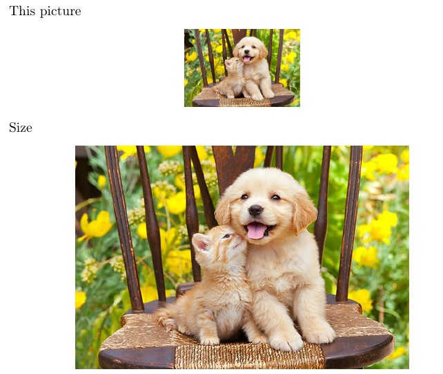
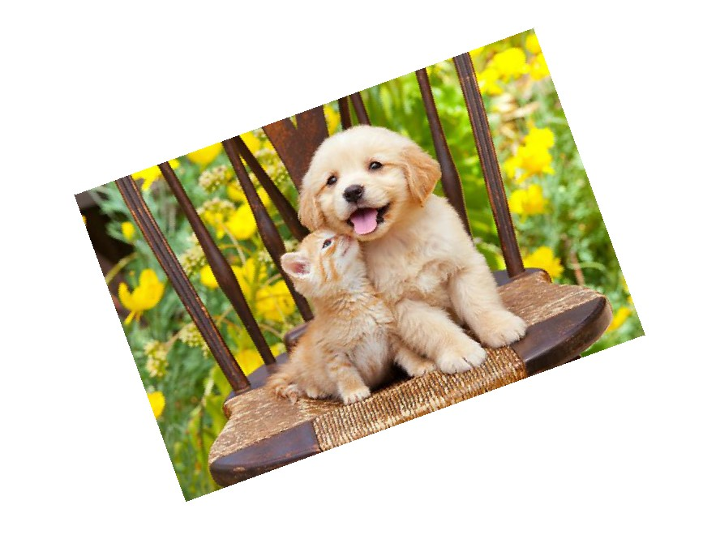
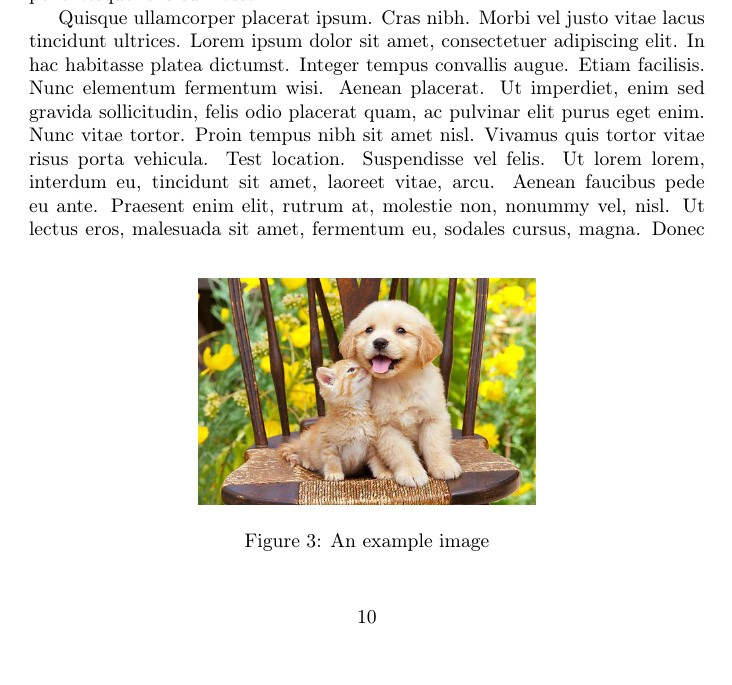
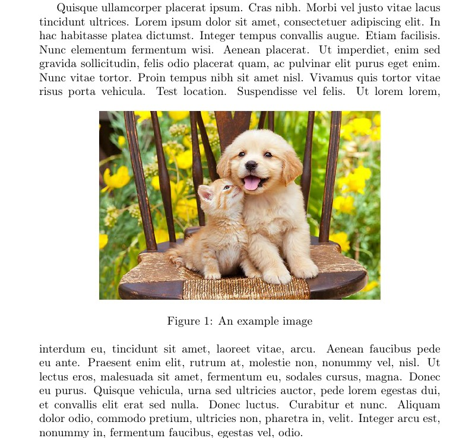
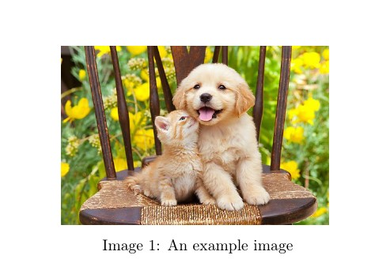
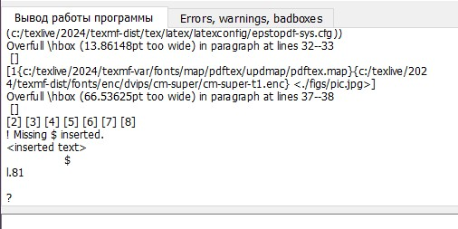

---
## Front matter
title: "Отчет по лабораторной работе №4"
subtitle: "Дисциплина: Computer Skills for Scientific Writing "
author: "Нирдоши Всеволод Раджендер"

## Generic otions
lang: ru-RU
toc-title: "Содержание"

## Bibliography
bibliography: cite.bib
csl: pandoc/csl/gost-r-7-0-5-2008-numeric.csl
link-citations: true

## Pdf output format
toc: true # Table of contents
toc-depth: 2
lof: true # List of figures
lot: true # List of tables
fontsize: 12pt
linestretch: 1.5
papersize: a4
documentclass: scrreprt

## I18n babel
babel-lang: russian
babel-otherlangs: english
## Fonts
## Критически важные настройки для русского языка
mainfont: IBM Plex Serif
## I18n polyglossia
## Настройки для русского языка
polyglossia-lang:
  name: russian
  options:
    - spelling=modern
    - babelshorthands=true
polyglossia-otherlangs:
  name: english

romanfont: IBM Plex Serif
sansfont: IBM Plex Sans
monofont: IBM Plex Mono
mathfont: STIX Two Math
romanfontoptions: Ligatures=Common,Ligatures=TeX,Scale=0.94
sansfontoptions: Ligatures=Common,Ligatures=TeX,Scale=MatchLowercase,Scale=0.94
monofontoptions: Scale=MatchLowercase,Scale=0.94,FakeStretch=0.9
mathfontoptions:
## Pandoc-crossref LaTeX customization
figureTitle: "Рис."
tableTitle: "Таблица"
listingTitle: "Листинг"
# lofTitle: "Список иллюстраций"
# lotTitle: "Список таблиц"
# lolTitle: "Листинги"
## Misc options
indent: true
header-includes:
  - \usepackage{indentfirst}
  - \usepackage{float} # keep figures where there are in the text
  - \floatplacement{figure}{H} # keep figures where there are in the text
---

### **Цель работы**

Изучить возможности вставки, изменения и размещения графических изображений в LaTeX, а также освоить работу с плавающими объектами, подписями и перекрёстными ссылками.

### **Задачи**

1. Освоить вставку собственных изображений в документ LaTeX.
2. Изучить ключи для изменения параметров графики (`height`, `width`, `scale`, `angle`, `trim`).
3. Научиться использовать относительные размеры `\textwidth` и `\linewidth`.
4. Освоить размещение изображений с помощью плавающих окружений `figure` и параметров `[h]`, `[t]`, `[b]`, `[H]`, `[p]`.
5. Научиться создавать перекрёстные ссылки между секциями, рисунками и уравнениями.
6. Исследовать влияние положения команды `\label` относительно `\caption`.
7. Проверить правильность использования команды `\label` внутри и вне окружения `equation`.

## **Ход работы**

### **1. Вставка изображений**

В документе использовался файл `pic.jpg` в качестве собственного изображения.
Подключение происходило через команду:

```latex
\includegraphics[width=0.7\textwidth]{pic.jpg}
```

Изображение корректно отображалось в документе.
Также для демонстрации использовались варианты с разными параметрами:

```latex
\includegraphics[height=2cm]{pic}
\includegraphics[height=0.3\textheight]{pic}
\includegraphics[width=0.9\textwidth]{pic}
```

Это позволило увидеть, как меняется размер при разных способах масштабирования.

Скриншот:



### **2. Изменение внешнего вида графики**

Были протестированы параметры `scale`, `angle`, `clip`, `trim`:

```latex
\includegraphics[scale=0.6, angle=20]{pic}
\includegraphics[clip, trim=50 25 50 30]{pic}
```

При изменении значений параметров наблюдалось изменение масштаба, поворота и обрезки изображения.

Скриншот:



### **3. Использование плавающих объектов**

Для демонстрации размещения изображений применялось окружение `figure` с разными параметрами:

```latex
\begin{figure}[ht]
  \centering
  \includegraphics[width=0.7\textwidth]{pic.jpg}
  \caption{An example image}
\end{figure}
```

Здесь LaTeX самостоятельно подбирает оптимальное место для рисунка.
Также были использованы другие спецификаторы: `[h]`, `[t]`, `[b]`, `[H]`, `[p]` для демонстрации поведения при разном размещении.
Текст-заполнитель создавался командой `\lipsum`.

Скриншот:



### **4. Плавающие объекты с точным позиционированием**

Использовался параметр `[H]` из пакета `float`:

```latex
\begin{figure}[H]
  \centering
  \includegraphics[width=0.7\linewidth]{pic}
  \caption{An example image}
\end{figure}
```

В этом случае изображение вставляется строго в том месте, где прописана команда.

Скриншот:



### **5. Другие типы плавающих объектов**

Для демонстрации использовался пакет `trivfloat`, позволяющий создавать новые типы плавающих окружений:

```latex
\begin{image}
  \centering
  \includegraphics[width=0.5\textwidth]{pic}
  \caption{An example image}
\end{image}
```

Это окружение работает аналогично `figure`, но с собственным названием и счётчиком.

Скриншот:



### **6. Перекрёстные ссылки**

Для демонстрации работы перекрёстных ссылок использованы команды `\label` и `\ref`:

```latex
\subsection{Subsection of the first section}
\label{subsec:labelone}
...
\begin{equation}
e^{i\pi}+1=0
\label{eq:labeltwo}
\end{equation}
In subsection~\ref{subsec:labelone} is equation~\ref{eq:labeltwo}.
```

После двойной компиляции ссылки корректно отображаются:

> В подразделе 2.1 находится уравнение (1).

Скриншот:


### **7. Дополнительные разделы**

Добавлены новые секции:

```latex
\section{Introduction}
\section{Next thing}
\label{sec:next}
```

и ссылки между ними:

```latex
Some exciting text with a reference~\ref{sec:next}.
```

После повторной компиляции ссылки отображаются корректно.

Скриншот:


### **8. Проверка расположения `\label` и `\caption`**

Проведён эксперимент с размещением команды `\label` до и после `\caption`.
Разницы не наблюдалось, так как в документе только одно изображение.
Однако теоретически правильный порядок:

```latex
\caption{Example}
\label{fig:example}
```

При обратном порядке возможна неверная нумерация при наличии нескольких рисунков.

### **9. Проверка размещения метки вне окружения equation**

Код:

```latex
 \begin{equation}
    e^{i\pi}+1 = 0
 \end{equation}
 \label{eq:labeltwo}
```

вызвал ошибку при компиляции, что подтверждает правило —
`\label` для формулы необходимо помещать **внутрь** окружения `equation`.

Скриншот:



## **Выполнение упражнений (раздел 4.9 Exercises)**

1. **Вставка собственного изображения:**
   Использовано изображение `pic.jpg` вместо стандартного примера.  

2. **Изменение параметров высоты, ширины, угла и масштаба:**
   Проведены эксперименты с параметрами `height`, `width`, `scale`, `angle`, `trim`.  

3. **Сравнение `\textwidth` и `\linewidth`:**
   Разницы не обнаружено, что объясняется одноколоночным режимом документа.  

4. **Размещение плавающих объектов:**
   Проверены все основные спецификаторы `[h]`, `[t]`, `[b]`, `[H]`, `[p]`.
   Продемонстрировано различие их работы.  

5. **Добавление новых секций и проверка работы `\label`:**
   Добавлены разделы и подразделы, перекрёстные ссылки работают после двойной компиляции.  

6. **Положение `\label` относительно `\caption`:**
   Проверено — при размещении `\label` до `\caption` возможна неправильная нумерация,
   но в данном документе видимой разницы не наблюдалось.  

7. **Метка после `\end{equation}`:**
   Получена ошибка, подтверждающая, что \label должен находиться **внутри** окружения `equation`.  

## **Результаты**

* На практике отработаны все способы вставки и редактирования изображений.
* Освоены параметры масштабирования, обрезки и поворота.
* Изучено поведение плавающих объектов при различных параметрах позиционирования.
* Проверена работа перекрёстных ссылок и подтверждена необходимость правильного порядка команд `\caption` и `\label`.
* Подтверждено, что метка `\label` должна размещаться **внутри** уравнения.

### **Вывод**

В ходе лабораторной работы были изучены основные принципы работы с графикой в системе LaTeX.
Я научился вставлять собственные изображения, изменять их параметры, управлять размещением рисунков и создавать перекрёстные ссылки.
Были выполнены все упражнения и проверены различные ситуации, включая правильное использование команд `\label` и `\caption`.
Работа выполнена полностью, цель достигнута.

### Список литературы {.unnumbered}

@book

