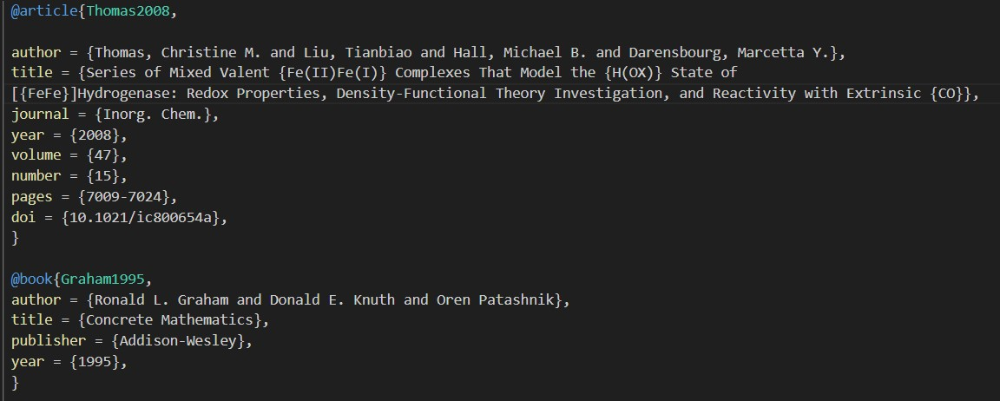
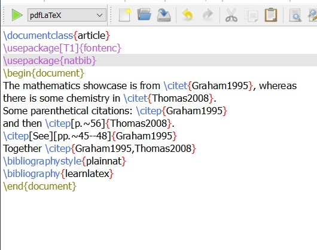
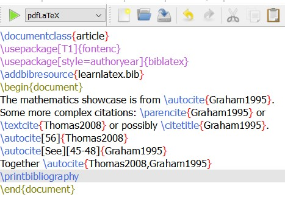
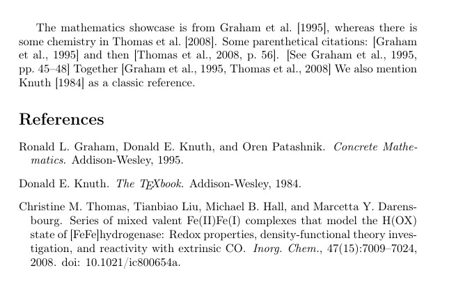
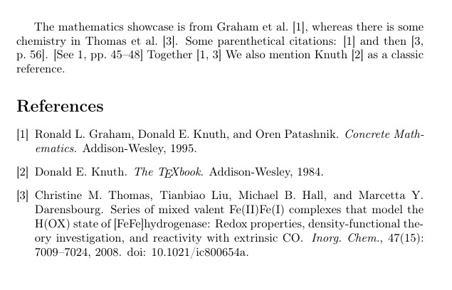

---
## Front matter
lang: ru-RU
title: Отчёт по лабораторной работе №6
author: Нирдоши Всеволод Раджендер
institute: 
    - РУДН, Москва, Россия

date: \today

## Formatting
## i18n babel
babel-lang: russian
babel-otherlangs: english

## Formatting pdf
toc: false
toc-title: Содержание
slide_level: 2
aspectratio: 169
section-titles: true
theme: metropolis
header-includes:
 - \metroset{progressbar=frametitle,sectionpage=progressbar,numbering=fraction}

##{:class="img-responsive"}
##{:height="50%" width="50%"}
##{:height="700px" width="400px"}
##{height=25}{width=150}
---

# **Презентация по лабораторной работе №6**

## **Тема**

**Библиография и ссылки в LaTeX: BibTeX, natbib, biblatex и Biber**

## **Цель работы**

Изучить создание библиографической базы данных в формате `.bib`  
и оформление ссылок в системе LaTeX с использованием:

* связки LaTeX + BibTeX + `natbib`;
* связки LaTeX + Biber + `biblatex`.

Понять последовательности компиляции и поведение при ошибках в ссылках.

## **Задачи**

1. Создать файл библиографии `learnlatex.bib` и заполнить его записями.
2. Освоить работу с пакетом `natbib` и классической связкой LaTeX–BibTeX.
3. Освоить работу с пакетом `biblatex` и системой Biber.
4. Разобраться, почему используются цепочки компиляции  
   LaTeX → BibTeX → LaTeX → LaTeX и LaTeX → Biber → LaTeX.
5. Исследовать поведение при добавлении новых записей в `.bib`.
6. Проверить реакцию системы на отсутствующие ключи.
7. Сравнить автор–год и числовой стиль цитирования  
   для `natbib` и `biblatex`.
8. Сформулировать выводы о преимуществах каждого подхода.

# **Создание библиографической базы**

## **Файл `learnlatex.bib`**

* Создан текстовый файл `learnlatex.bib`.
* Добавлены две записи: статья и книга.
* Ключи цитирования: `Thomas2008`, `Graham1995`.

## Скриншот

{height=220}

# **Связка LaTeX + BibTeX + natbib**

## **Пример с `natbib`**

{height=200}

* Подключение: `\usepackage{natbib}`.
* Стиль: `\bibliographystyle{plainnat}`.
* База: `\bibliography{learnlatex}`.


## **Цитаты в стиле автор–год (natbib)**

* Текстовые и скобочные ссылки:

  * `\citet{Graham1995}` → *Graham (1995)*;
  * `\citep{Graham1995}` → *(Graham, 1995)*;
  * `\citep[p.~56]{Thomas2008}` → *(Thomas, 2008, p. 56)*;
  * `\citep[See][pp.~45--48]{Graham1995}`.

* Список литературы автоматически формируется из `learnlatex.bib`
  через промежуточный файл `*.bbl`.

# **Связка LaTeX + Biber + biblatex**

## **Пример с `biblatex`**

{height=200}

* Стиль задаётся в опции: `style=authoryear`.
* База подключается через `\addbibresource{learnlatex.bib}`.
* Вывод списка литературы: `\printbibliography`.

## **Цитаты в стиле автор–год (biblatex)**

* Основные команды:

  * `\autocite{...}` — автоматический выбор формата;
  * `\parencite{...}` — скобочная ссылка;
  * `\textcite{...}` — автор в тексте, год в скобках;
  * `\citetitle{...}` — только название работы.

* Логику форматирования полностью контролирует пакет `biblatex`,
  а Biber отвечает за обработку базы данных.

# **Упражнения (раздел 6.9)**

## **Вопрос 1. Последовательности компиляции**

**Для `natbib`: LaTeX → BibTeX → LaTeX → LaTeX**

1. Первый запуск LaTeX:

   * создаётся файл `*.aux`;
   * записываются ключи ссылок;
   * в PDF появляются временные `?`.

2. Запуск BibTeX:

   * читает `*.aux` и `learnlatex.bib`;
   * формирует `*.bbl` со списком литературы.

## **Вопрос 1. Последовательности компиляции**

3. Второй LaTeX:

   * подключает `*.bbl`;
   * впервые выводит список литературы;
   * часть `?` может ещё сохраняться.

4. Третий LaTeX:

   * все ссылки пересчитываются;
   * `?` исчезают, ссылки окончательно выравниваются.

## **Вопрос 1. Последовательности компиляции (продолжение)**

**Для `biblatex`: LaTeX → Biber → LaTeX**

1. Первый LaTeX:

   * фиксирует команды `\autocite`, `\textcite`, `\addbibresource`;
   * готовит служебные файлы для Biber.

2. Biber:

   * читает `learnlatex.bib` и служебные файлы;
   * строит структурированные данные для `biblatex`.

3. Второй LaTeX:

   * использует данные Biber;
   * формирует ссылки и `\printbibliography`.

Четвёртый запуск обычно не нужен: система уже имеет полную информацию обо всех ссылках.

## **Вопрос 2. Добавление новой записи в `.bib`**

* В `learnlatex.bib` добавлена новая книга:

```latex
@book{Knuth1984,
  author    = {Donald E. Knuth},
  title     = {The {\TeX}book},
  publisher = {Addison-Wesley},
  year      = {1984},
}
```

* В документе с `natbib`:

```latex
We also mention \citet{Knuth1984} as a classic reference.
```

* В документе с `biblatex`:

```latex
Another key work is \textcite{Knuth1984}.
```

## **Вопрос 2. Результат (новая запись)**

* После повторной компиляции:

  * для `natbib`: LaTeX → BibTeX → LaTeX → LaTeX;
  * для `biblatex`: LaTeX → Biber → LaTeX.

* В обоих вариантах:

  * новая ссылка появилась в тексте;
  * в списке литературы автоматически добавлен новый элемент.

## Скриншот

{height=220}

## **Вопрос 3. Отсутствующий ключ**

**Эксперимент:**

* В `natbib`:

```latex
This is a missing citation: \citep{DoesNotExist2025}.
```

* В `biblatex`:

```latex
This is a missing citation: \autocite{DoesNotExist2025}.
```

* В `learnlatex.bib` **нет** записи с ключом `DoesNotExist2025`.

## **Вопрос 3. Результат (ошибка в ссылке)**

* **natbib + BibTeX:**

  * в тексте на месте ссылки — `?` или `??`;
  * в логе предупреждение:
    `Citation 'DoesNotExist2025' undefined`.

* **biblatex + Biber:**

  * в тексте — сам ключ `DoesNotExist2025` (часто полужирный);
  * также предупреждение об неопределённой ссылке.

Это помогает быстро находить опечатки в ключах.

## Скриншот

{height=220}

## **Вопрос 4. Переход к числовому стилю (`natbib`)**

* Изначально:

```latex
\usepackage{natbib}
```

* Для числового стиля:

```latex
\usepackage[numbers]{natbib}
```

* После повторной компиляции:

  * ссылки `\citep{Graham1995}` → ([1]), ([2]) и т.д.;
  * список литературы становится пронумерованным.

* Команды `\citet`, `\citep` сохраняются,
  меняется только формат ссылок и библиографии.

## **Вопрос 4. Числовой стиль (`biblatex`)**

* Изначально:

```latex
\usepackage[style=authoryear]{biblatex}
```

* Для числового стиля:

```latex
\usepackage[style=numeric]{biblatex}
```

* После LaTeX → Biber → LaTeX:

  * все ссылки в тексте становятся числовыми (([1]), ([2]));
  * список литературы — пронумерованный список;
  * номера в ссылках и списке совпадают.

Преимущество `biblatex`: смена стиля делается одной опцией `style=...`.

## Скриншот

{height=220}

# **Итоги работы**

## **Результаты**

* Создан и заполнен файл `learnlatex.bib`
  (статья `Thomas2008`, книга `Graham1995`, дополнительная книга `Knuth1984`).

* Реализованы два подхода:

  * LaTeX + BibTeX + `natbib`;
  * LaTeX + Biber + `biblatex`.

* На практике отработаны последовательности компиляции:

  * LaTeX → BibTeX → LaTeX → LaTeX;
  * LaTeX → Biber → LaTeX.

* Исследовано:

  * добавление новых записей в `.bib`;
  * поведение при отсутствующем ключе;
  * переход от автор–год к числовому стилю ссылок.

## **Выводы**

* Файл `.bib` позволяет хранить общую базу источников
  и использовать её в разных документах.
* Классическая схема (BibTeX + `natbib`) проста и широко поддерживается.
* Современная схема (`biblatex` + Biber) даёт:

  * более гибкие стили;
  * удобную работу с языками и полями;
  * лёгкое переключение между автор–год и numeric.

Все четыре упражнения по работе с библиографией выполнены,
цель лабораторной работы достигнута.

## **Список литературы**

1. Львовский С.М. *Набор и вёрстка в системе LaTeX*. Москва: МЦНМО, 2014. 400 с.

## {.standout}

Спасибо за внимание!
