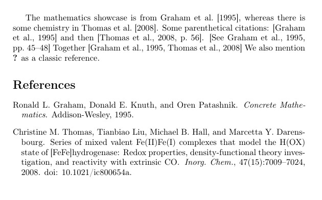

---
## Front matter
title: "Отчет по лабораторной работе №6"
subtitle: "Дисциплина: Computer Skills for Scientific Writing "
author: "Нирдоши Всеволод Раджендер"

## Generic otions
lang: ru-RU
toc-title: "Содержание"

## Bibliography
bibliography: cite.bib
csl: pandoc/csl/gost-r-7-0-5-2008-numeric.csl
link-citations: true

## Pdf output format
toc: true # Table of contents
toc-depth: 2
lof: true # List of figures
lot: true # List of tables
fontsize: 12pt
linestretch: 1.5
papersize: a4
documentclass: scrreprt

## I18n babel
babel-lang: russian
babel-otherlangs: english
## Fonts
## Критически важные настройки для русского языка
mainfont: IBM Plex Serif
## I18n polyglossia
## Настройки для русского языка
polyglossia-lang:
  name: russian
  options:
    - spelling=modern
    - babelshorthands=true
polyglossia-otherlangs:
  name: english

romanfont: IBM Plex Serif
sansfont: IBM Plex Sans
monofont: IBM Plex Mono
mathfont: STIX Two Math
romanfontoptions: Ligatures=Common,Ligatures=TeX,Scale=0.94
sansfontoptions: Ligatures=Common,Ligatures=TeX,Scale=MatchLowercase,Scale=0.94
monofontoptions: Scale=MatchLowercase,Scale=0.94,FakeStretch=0.9
mathfontoptions:
## Pandoc-crossref LaTeX customization
figureTitle: "Рис."
tableTitle: "Таблица"
listingTitle: "Листинг"
# lofTitle: "Список иллюстраций"
# lotTitle: "Список таблиц"
# lolTitle: "Листинги"
## Misc options
indent: true
header-includes:
  - \usepackage{indentfirst}
  - \usepackage{float} # keep figures where there are in the text
  - \floatplacement{figure}{H} # keep figures where there are in the text
---

### **Лабораторная работа № 6. Библиография и ссылки в LaTeX**

### **Цель работы**

Изучить создание библиографической базы данных в формате `.bib` и оформление ссылок в системе LaTeX с использованием связки BibTeX/`natbib` и Biber/`biblatex`. Понять последовательности компиляции, поведение при отсутствующих записях и различия между автор–год и числовыми стилями цитирования.

### **Задачи**

1. Создать файл библиографии `learnlatex.bib` и заполнить его записями.
2. Освоить работу с пакетом `natbib` и классической связкой LaTeX–BibTeX.
3. Освоить работу с пакетом `biblatex` и системой Biber.
4. Разобраться, почему используется последовательность компиляции
   LaTeX → BibTeX → LaTeX → LaTeX и LaTeX → Biber → LaTeX.
5. Исследовать поведение при добавлении новых записей в `.bib`.
6. Сравнить автор–год и числовой стиль цитирования для `natbib` и `biblatex` (вопрос 4 из упражнений).
7. Сделать выводы о преимуществах и особенностях каждого подхода.

## **Ход работы**

### **1. Создание библиографической базы данных `learnlatex.bib`**

На первом этапе был создан текстовый файл `learnlatex.bib`, в который были добавлены две библиографические записи — журнальная статья и книга:

```latex
@article{Thomas2008,
  author  = {Thomas, Christine M. and Liu, Tianbiao and Hall, Michael B.
             and Darensbourg, Marcetta Y.},
  title   = {Series of Mixed Valent {Fe(II)Fe(I)} Complexes That Model the {H(OX)}
             State of [{FeFe}]Hydrogenase: Redox Properties, Density-Functional
             Theory Investigation, and Reactivity with Extrinsic {CO}},
  journal = {Inorg. Chem.},
  year    = {2008},
  volume  = {47},
  number  = {15},
  pages   = {7009-7024},
  doi     = {10.1021/ic800654a},
}

@book{Graham1995,
  author    = {Ronald L. Graham and Donald E. Knuth and Oren Patashnik},
  title     = {Concrete Mathematics},
  publisher = {Addison-Wesley},
  year      = {1995},
}
```

Каждой записи присвоен уникальный **ключ цитирования**: `Thomas2008` и `Graham1995`. Именно эти ключи затем используются в командах `\citet{...}`, `\citep{...}`, `\autocite{...}`, `\textcite{...}` и т.д.

### **2. Работа с пакетом `natbib` и BibTeX**

Для проверки классического подхода был создан документ с использованием пакета `natbib`:

```latex
\documentclass{article}
\usepackage[T1]{fontenc}
\usepackage{natbib}
\begin{document}

The mathematics showcase is from \citet{Graham1995}, whereas
there is some chemistry in \citet{Thomas2008}.

Some parenthetical citations: \citep{Graham1995}
and then \citep[p.~56]{Thomas2008}.

\citep[See][pp.~45--48]{Graham1995}
Together \citep{Graham1995,Thomas2008}

\bibliographystyle{plainnat}
\bibliography{learnlatex}

\end{document}
```

Основные моменты:

* Подключение пакета: `\usepackage{natbib}`.
* Автор–год стиль цитирования задаётся через `\bibliographystyle{plainnat}`.
* База данных подключается через `\bibliography{learnlatex}` (без расширения `.bib`).
* Для текстовых и скобочных ссылок используются команды:

  * `\citet{Graham1995}` — ссылка вида “Graham (1995)”.
  * С дополнительной информацией: `\citep[p.~56]{Thomas2008}` и
    `\citep[See][pp.~45--48]{Graham1995}`.

#### Последовательность компиляции для `natbib`

Для данного варианта соблюдалась последовательность:

1. LaTeX
2. BibTeX
3. LaTeX
4. LaTeX

Причины такой последовательности подробно разобраны ниже в разделе «Выполнение упражнений», вопрос 1.

### **3. Работа с пакетом `biblatex` и Biber**

Далее был создан аналогичный пример, но уже с использованием пакета `biblatex` и программы Biber:

```latex
\documentclass{article}
\usepackage[T1]{fontenc}
\usepackage[style=authoryear]{biblatex}
\addbibresource{learnlatex.bib} % file of reference info

\begin{document}

The mathematics showcase is from \autocite{Graham1995}.

Some more complex citations: \parencite{Graham1995} or
\textcite{Thomas2008} or possibly \citetitle{Graham1995}.

\autocite[56]{Thomas2008}
\autocite[See][45-48]{Graham1995}
Together \autocite{Thomas2008,Graham1995}

\printbibliography

\end{document}
```

Особенности:

* Пакет подключается с указанием стиля:
  `\usepackage[style=authoryear]{biblatex}`.
* Вместо `\bibliography` используется команда
  `\addbibresource{learnlatex.bib}`, причём здесь **обязательно** указывается полное имя файла с расширением `.bib`.
* Для вывода списка литературы применяется `\printbibliography`.
* Для ссылок используются команды:

  * `\autocite{...}` — автоматический выбор формата ссылки.
  * `\parencite{...}` — скобочная ссылка.
  * `\textcite{...}` — ссылка в тексте с автором.
  * `\citetitle{...}` — только название работы.

#### Последовательность компиляции для `biblatex`

Для данного варианта использована последовательность:

1. LaTeX
2. Biber
3. LaTeX

Объяснение причин также приведено ниже во «Выполнении упражнений», вопрос 1.

## **Выполнение упражнений (раздел 6.9 Exercises)**

В данной лабораторной работе основное внимание уделено четырём вопросам из раздела упражнений, связанных с оформлением ссылок.

### **Вопрос 1. Объяснение последовательностей LaTeX–BibTeX–LaTeX–LaTeX и LaTeX–Biber–LaTeX**

**Для `natbib` (LaTeX → BibTeX → LaTeX → LaTeX).**

1. **Первый запуск LaTeX.**
   На этом этапе LaTeX:

   * обрабатывает основной текст,
   * видит команды `\citet{...}`, `\citep{...}`,
   * записывает список использованных ключей (`Graham1995`, `Thomas2008` и др.) во вспомогательный файл `*.aux`.
     В результате в PDF вместо нормальных ссылок обычно появляются `?`, т.к. список литературы ещё не сформирован.

2. **Запуск BibTeX.**
   Программа BibTeX читает:

   * файл `learnlatex.bib`,
   * вспомогательный файл `*.aux` с перечнем ключей.
     На основе этого создаётся файл `*.bbl`, который содержит уже готовый фрагмент LaTeX-кода со списком литературы в нужном стиле (`plainnat`).

3. **Второй запуск LaTeX.**
   Теперь LaTeX:

   * подключает сгенерированный BibTeX-ом файл `*.bbl`,
   * может впервые сформировать список литературы в конце документа.
     На этом шаге часть `?` ещё может оставаться, так как информация о номерах и форматах ссылок только что обновилась.

4. **Третий запуск LaTeX.**
   LaTeX повторно читает все данные (включая уже корректный список литературы) и:

   * подставляет окончательные значения ссылок,
   * убирает `?`, выравнивает перекрёстные ссылки.

Таким образом, последовательность LaTeX → BibTeX → LaTeX → LaTeX необходима, чтобы:

* сначала собрать информацию о ссылках,
* затем сформировать список литературы,
* и наконец корректно подставить все ссылки в текст.

**Для `biblatex` (LaTeX → Biber → LaTeX).**

Здесь достаточно **трёх** запусков:

1. **Первый LaTeX.**
   LaTeX обрабатывает документ, видит команды `\autocite{...}`, `\textcite{...}`, `\addbibresource{learnlatex.bib}`, и записывает информацию о ссылках в служебные файлы для Biber.

2. **Biber.**
   Biber читает:

   * `learnlatex.bib`,
   * данные из служебных файлов LaTeX,
     и формирует собственный промежуточный формат (не `*.bbl` в классическом виде, а более богатую структуру данных для `biblatex`).

3. **Второй LaTeX.**
   На этом шаге LaTeX, совместно с `biblatex`, использует данные Biber:

   * подставляет форматированные ссылки,
   * строит список литературы `\printbibliography`.

Четвёртый запуск обычно не требуется: `biblatex` и Biber организуют обмен данными так, что уже после второй компиляции LaTeX все ссылки оказываются корректными. Если же меняется много перекрёстных ссылок, иногда делают ещё один запуск LaTeX, но базовая схема — именно LaTeX → Biber → LaTeX.

Кроме того, если в коде указать несуществующий ключ, `biblatex` не оставляет просто `?`, а выводит сам ключ (часто выделяя его визуально), чтобы было ясно, какой именно ключ не найден.

### **Вопрос 2. Добавление новой записи в `.bib` и повторная компиляция**

В этом упражнении была проверена работа системы при добавлении новой записи в базу данных.

1. В файл `learnlatex.bib` была добавлена новая книга, например:

   ```latex
   @book{Knuth1984,
     author    = {Donald E. Knuth},
     title     = {The {\TeX}book},
     publisher = {Addison-Wesley},
     year      = {1984},
   }
   ```

2. В документе с `natbib` была вставлена дополнительная ссылка:

   ```latex
   We also mention \citet{Knuth1984} as a classic reference.
   ```

3. В документе с `biblatex` была добавлена ссылка:

   ```latex
   Another key work is \textcite{Knuth1984}.
   ```

4. После этого:

   * для варианта с `natbib` снова была выполнена последовательность
     LaTeX → BibTeX → LaTeX → LaTeX;
   * для варианта с `biblatex` — LaTeX → Biber → LaTeX.

Скриншот:


Результат:

* В обоих документах новая ссылка появилась в тексте.
* В конце был автоматически добавлен новый элемент списка литературы.
* Факт добавления нового источника не требует никаких дополнительных команд: достаточно добавить запись в `.bib` и процитировать её в тексте.

### **Вопрос 3. Цитирование записи, которой нет в базе данных**

Здесь проверялось поведение системы при использовании **несуществующего ключа**.

1. В документе с `natbib` была добавлена строка вида:

   ```latex
   This is a missing citation: \citep{DoesNotExist2025}.
   ```

   При этом запись `DoesNotExist2025` **не** добавлялась в `learnlatex.bib`.

2. Аналогично, в документе с `biblatex` была добавлена строка:

   ```latex
   This is a missing citation: \autocite{DoesNotExist2025}.
   ```

   И здесь соответствующей записи в `.bib` тоже не было.

После компиляции:

* **Вариант `natbib` (BibTeX).**

  * В тексте PDF на месте ссылки появляется `?` или `??`.
  * В лог-файле присутствует предупреждение `Citation 'DoesNotExist2025' undefined`.
  * Это сигнализирует о том, что в `.bib` нет записи с таким ключом.

* **Вариант `biblatex` (Biber).**

  * Пакет `biblatex` обычно выводит сам ключ (например, `DoesNotExist2025`) в заметном формате (часто полужирным) в месте ссылки, чтобы сразу было видно, какой именно ключ не найден.
  * В лог-файле также появляется предупреждение о неопределённой ссылке.
  * Таким образом, вместо `?` видно “сырой” ключ, что иногда удобнее при отладке.

Именно это было зафиксировано в ходе работы: в варианте с `natbib` на месте ссылки появился знак вопроса, а при использовании `biblatex` в выводе был показан именно ключ ссылки, визуально выделенный.

Скриншот:



### **Вопрос 4. Переход к числовому стилю: `natbib` и `biblatex`**

В последнем упражнении проверялось, как изменить стиль ссылок с автор–год на **числовой**.

#### 4.1. Числовой стиль в `natbib`

Изначально в преамбуле использовалась строка:

```latex
\usepackage{natbib}
```

Чтобы перейти к числовому стилю, она была заменена на:

```latex
\usepackage[numbers]{natbib}
```

После повторной компиляции:

* ссылки вида `\citep{Graham1995}` стали отображаться как числовые — ([1]), ([2]) и т.п.;
* в списке литературы записи автоматически получили номера, соответствующие этим ссылкам.

Команды `\citet` и `\citep` при этом не меняются, меняется только способ оформления ссылок.

#### 4.2. Числовой стиль в `biblatex`

Для `biblatex` в изначальном примере использовалась строка:

```latex
\usepackage[style=authoryear]{biblatex}
```

Чтобы сделать стиль числовым, она была изменена на:

```latex
\usepackage[style=numeric]{biblatex}
```

После последовательности LaTeX → Biber → LaTeX:

* все ссылки в тексте стали числовыми (например, ([1]));
* список литературы автоматически оформился как пронумерованный список,
  номера в списке совпали с номерами в ссылках.

Преимущество `biblatex` состоит в том, что смена стиля (`style=...`) даёт очень гибкую настройку формата ссылок и библиографии, не затрагивая основную структуру документа.

Скриншот:


## **Результаты**

* Создан файл библиографии `learnlatex.bib` с корректными записями для статьи `Thomas2008` и книги `Graham1995`, а также дополнительной книги (например, `Knuth1984`).
* Реализованы два варианта оформления ссылок:

  * классический LaTeX + BibTeX с использованием пакета `natbib`;
  * современный LaTeX + Biber с использованием пакета `biblatex`.
* Подробно разобраны и на практике проверены последовательности компиляции:

  * LaTeX → BibTeX → LaTeX → LaTeX для `natbib`;
  * LaTeX → Biber → LaTeX для `biblatex`.
* Продемонстрировано добавление новой записи в `.bib` и автоматическое обновление списка литературы при повторной компиляции.
* Исследовано поведение при использовании несуществующего ключа:

  * в `natbib` — появление `?` в тексте и предупреждение в логе;
  * в `biblatex` — вывод самого ключа (часто выделенного) и соответствующее предупреждение.
* Проведено сравнение автор–год и числового стиля:

  * для `natbib` через опцию `[numbers]` в `\usepackage{natbib}`;
  * для `biblatex` через параметр `style=numeric`.

### **Вывод**

В ходе лабораторной работы были изучены и практически освоены основные подходы к работе с библиографией в LaTeX:

* Показано, как создавать и наполнять файл `*.bib` и использовать его как единый источник данных для нескольких документов.
* Разобрана работа связки LaTeX–BibTeX–`natbib`, а также LaTeX–Biber–`biblatex`, и объяснено, почему требуются несколько запусков компиляции.
* Исследовано поведение системы при добавлении новых источников и при ошибках (несуществующие ключи).
* Продемонстрирована простота перехода от автор–год к числовому стилю ссылок в обоих подходах.

Все четыре упражнения, относящиеся к работе с ссылками и библиографией, выполнены; цель лабораторной работы достигнута.

### Список литературы {.unnumbered}

@book


